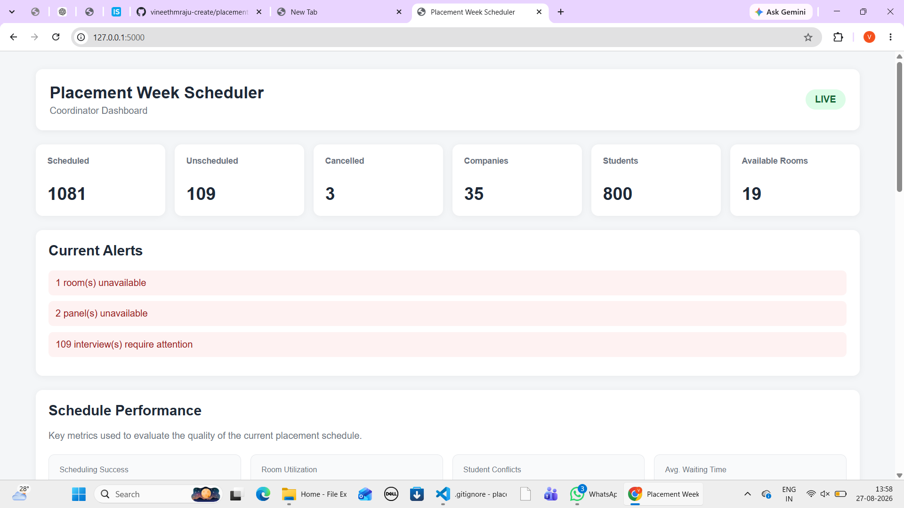
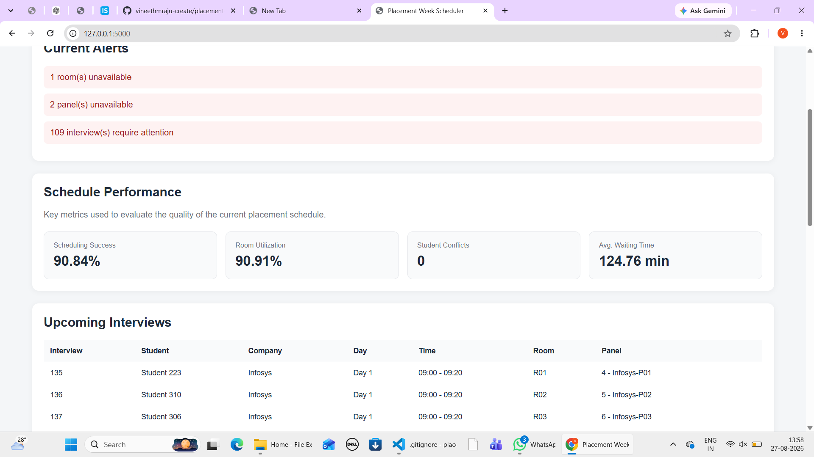
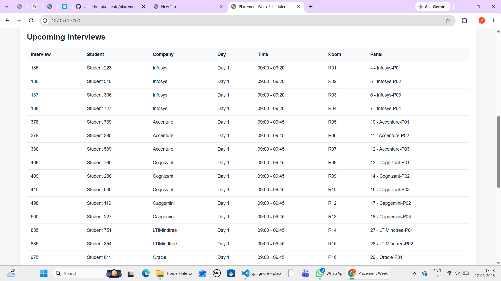
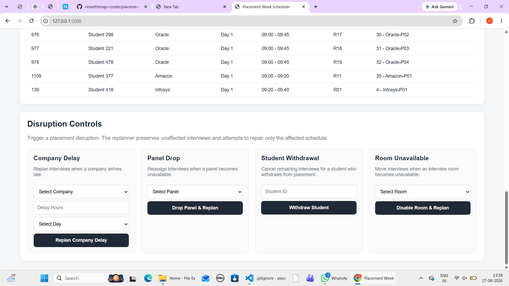

# Placement Week Scheduler

A dynamic placement interview scheduling and replanning system developed for the **Mirai Labs Software Developer Intern Technical Assessment**.

The system generates a realistic placement-week dataset, creates a feasible interview schedule under multiple constraints, and dynamically replans the schedule when disruptions occur.

---

## Project Overview

College placement weeks involve several scheduling challenges:

- Hundreds of students
- Multiple companies
- Limited interview rooms
- Multiple company panels
- Students shortlisted by several companies
- Overlapping interview schedules
- Companies arriving late
- Panels becoming unavailable
- Students withdrawing
- Rooms becoming unavailable

The Placement Week Scheduler replaces manual whiteboard-based coordination with an automated scheduling and replanning system.

---

## Core Features

### Realistic Dataset Generation

The system generates:

- 35 companies
- 800 students
- 20 interview rooms
- Company interview panels
- CGPA cutoffs
- Interview durations
- Priority tiers
- Company availability days
- Overlapping student shortlists

The generated dataset attempts to model realistic placement-season behavior where popular companies shortlist larger numbers of students and strong students may appear in several company shortlists.

---

## Initial Scheduling Engine

The scheduler automatically assigns:

- Student
- Company
- Interview panel
- Room
- Day
- Start time
- End time

The scheduling engine uses hard constraints to prevent invalid assignments.

### Hard Constraints

The scheduler ensures:

- A student cannot attend two interviews at the same time.
- A room cannot host two interviews at the same time.
- A panel cannot conduct two interviews at the same time.
- Interview durations are respected.
- Interviews occur only on company-available days.
- Withdrawn students are not scheduled.

When an interview cannot be scheduled, the system reports it instead of silently ignoring it.

---

## Replanning Under Disruption

The system supports the four mandatory disruption scenarios.

### 1. Company Delay

When a company arrives late:

- Only affected interviews are identified.
- Unaffected appointments remain unchanged.
- The system searches for later feasible time slots.
- Original rooms and panels are preferred when possible.
- Later company days are considered if the same day is infeasible.
- Unscheduled interviews are reported clearly.

### 2. Panel Drop

When a company panel becomes unavailable:

- Interviews assigned to the dropped panel are identified.
- Another panel from the same company is preferred.
- The scheduler attempts to preserve the original day and time.
- Nearby later slots are searched when necessary.
- Remaining infeasible interviews are reported.

### 3. Student Withdrawal

When a student withdraws:

- The student status changes to `WITHDRAWN`.
- All remaining scheduled interviews for that student are changed to `CANCELLED`.
- Records are retained for audit/history.
- A list of companies that must be informed is generated.

### 4. Room Unavailable

When a room becomes unavailable:

- Only interviews assigned to that room are affected.
- The system attempts to move them to other available rooms.
- The original day and interview time are preserved whenever possible.
- Interviews that cannot be repaired are clearly reported.

---

## Minimal Replanning Strategy

A major design goal of the project is to minimize schedule disruption.

Instead of regenerating the entire placement schedule after every problem, the system uses a **local repair strategy**.

The general approach is:

1. Detect the disruption.
2. Identify only affected interviews.
3. Freeze unaffected interviews.
4. Search for the smallest feasible changes.
5. Reassign affected interviews.
6. Report a schedule diff.
7. Notify affected students/companies.
8. Calculate replan churn.

This prevents unnecessary changes to hundreds of unaffected appointments.

---

## Schedule Quality Metrics

The project defines several metrics for evaluating schedule quality.

### Scheduling Success Rate

Percentage of required interviews successfully scheduled.

### Room Utilization

Percentage of available room-time used for interviews.

### Student Conflict Count

Number of overlapping interviews assigned to the same student.

The target value is:

```text
## Screenshots

### Coordinator Dashboard


### Interview Schedule


### Disruption Controls


### Dynamic Replanning Result
